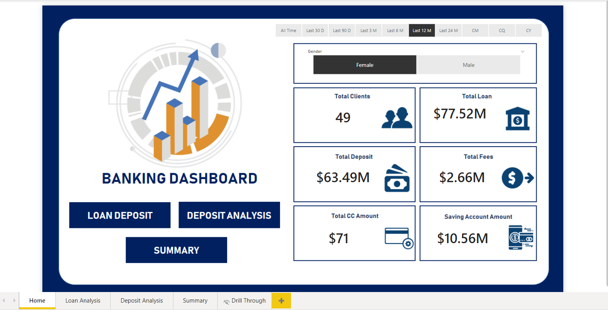
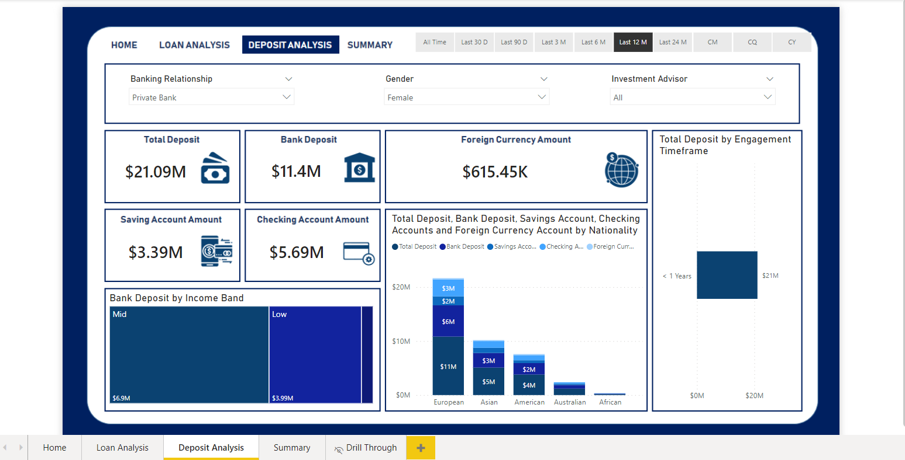
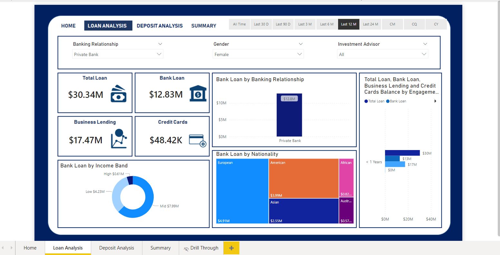
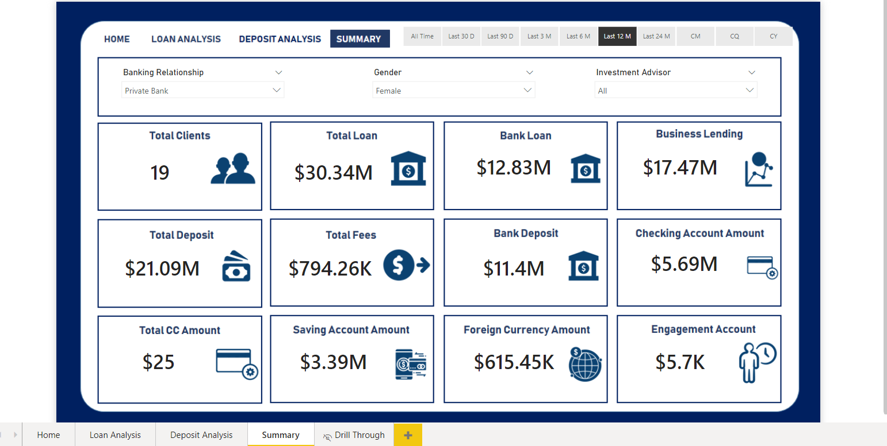

# 🏦 Banking Dashboard Analysis (Power BI)

# 📌 Problem Statement
Develop a basic understanding of risk analytics in banking and financial services and understand how data is used to minimise the risk of losing money while lending to customers.
# 💡 Solution
This project uses Power BI dashboards to help banks:
- Analyze applicant profiles  
- Evaluate loan repayment capability  
- Make data-driven decisions  
- Reduce financial risk

 With our dashboards which are created using Power BI latest tools helps the company to make a decision based on the applicant’s profile like if the applicant is likely to repay the loan then approving the loan otherwise not. 

# 📊 Project Overview
The Banking Dashboard provides a complete analysis of:
- Loan Analysis  
- Deposit Analysis  
- Summary Dashboard  
- KPI Monitoring  

It helps stakeholders understand financial performance and customer behavior.

# 🗂️ Dataset Description
This dataset basically contains information about bank details ,various client details which consists of multiple tables which are interlinked with each other through keys like primary key and foreign key.
The various tables are Banking Relationship, Client-Banking, Gender, Investment Advisor and Period.

# 🧹 Data Cleaning & Transformation
- Created Engagement Timeframe column  
- Created Engagement Days column using DATEDIFF  
- Created Income Band (Low / Mid)  
- Added Processing Fees column based on Fee Structure  

# 📐 DAX Calculations

### SUM
Bank Deposit = SUM('Clients - Banking'[Bank Deposits])

### DISTINCTCOUNT
Total Clients = DISTINCTCOUNT('Clients - Banking'[Client ID])

## SUMX
Total Fees = SUMX('Clients - Banking', [Total Loan] * 'Clients - Banking'[Processing Fees])

### DATEDIFF
Engagement Days = DATEDIFF('Clients - Banking'[Joined Bank], TODAY(), DAY)

### SWITCH
Used for conditional logic and categorization.

## 📊 Key KPIs
- Total Clients  
- Total Loan  
- Bank Loan  
- Business Lending  
- Total Deposit  
- Total Fees  
- Checking Account Amount  
- Saving Account Amount  
- Credit Card Amount  
- Foreign Currency Amount

# 🖼️ Dashboard Preview

### Home Dashboard

### Deposit Analysis

### Loan Analysis

### Summary Dashboard
  

# 📊 Dashboard Pages

### 🏠 Home Dashboard
- Overall KPIs  
- Navigation buttons  

### 📉 Loan Analysis
- Loan by Income Band  
- Loan by Nationality  
- Business Lending insights  

### 💰 Deposit Analysis
- Deposit distribution  
- Account-level insights  
- Engagement timeframe  

### 📊 Summary Dashboard
- Combined KPIs  
- Overall performance  

# 📈 Key Insights
- Mid-income customers contribute the most to loans  
- European customers have the highest banking activity  
- Australian and African regions show lower engagement  
- Deposits are distributed across multiple account types  

# 🛠️ Tools & Technologies
- Power BI  
- Excel  
- DAX  
- Power Query  

# 📂 Project Structure
📁 Banking-Dashboard  
 ┣ 📂 images  
 ┃ ┣ Home.png  
 ┃ ┣ Deposite Analysis.png  
 ┃ ┣ Loan Analysis.png  
 ┃ ┣ Summary.png  
 ┣ README.md  
 ┣ Banking.xlsx  
 ┣ Banking.pbix  
 ┣ Banking Report.docx  

# 🚀 Business Impact
- Improves loan risk analysis  
- Enables data-driven decision-making  
- Identifies high-value customers  
- Tracks financial performance   
